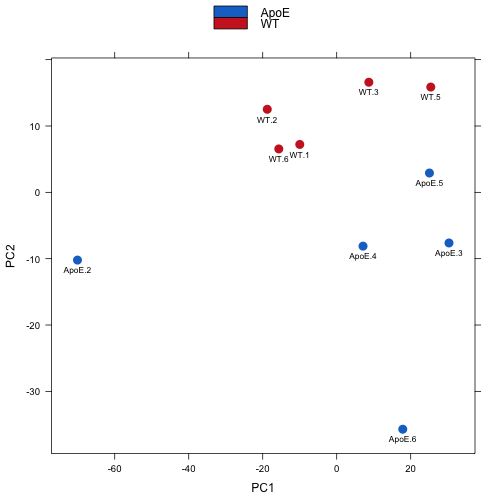
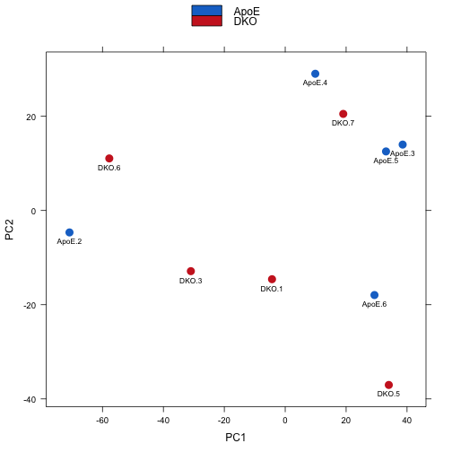
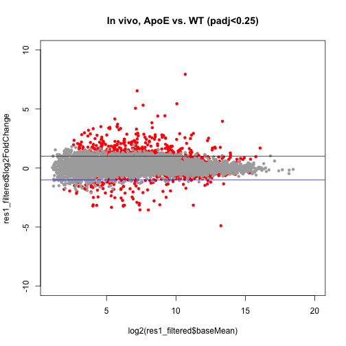
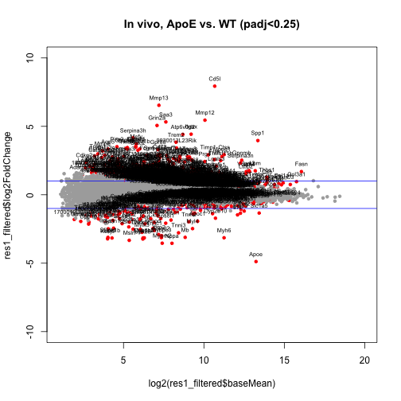
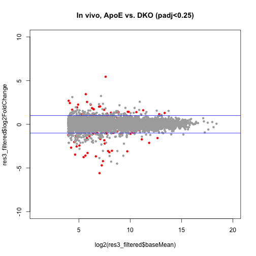
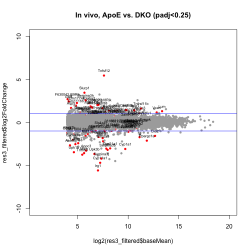
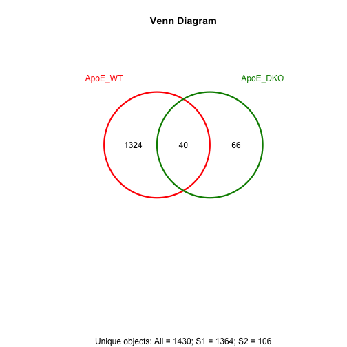
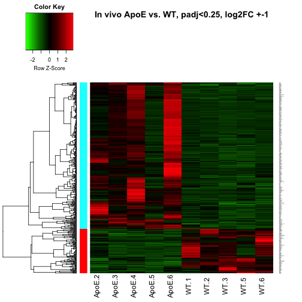

Analysis file available for download here:
https://github.com/ljcohen/ljcohen.github.io/tree/master/analyses/Blanco/

Script associated with this report can be accessed here:
https://github.com/ljcohen/ljcohen.github.io/tree/master/analyses/Blanco/scripts/DESeq2_Blanco_invivo_8.24.2015.Rmd

ApoE vs. WT


ApoE vs. DKO
  

Size of data table, all ApoE vs. WT data

```
## [1] 16903    17
```

ApoE vs. WT, padj<0.25

```
## [1] 1364   17
```

  

Size of data table, all ApoE vs. DKO data

```
## [1] 15917    17
```

ApoE vs. DKO, padj<0.25

```
## [1] 106  17
```

  


```
## [1] 1364
```

```
## [1] 106
```

 


ApoE vs. WT heatmap
restrict to padj<0.01 and log2FC+-1


```
## NULL
```

 
