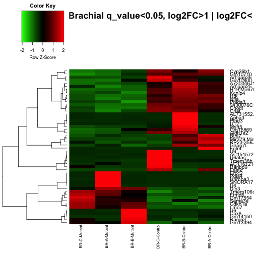

Script for these figures:
https://github.com/ljcohen/ljcohen.github.io/tree/master/analyses/Dasen/scripts/Dasen_RNAseq_report_controls_padj_nologFCcutoff.Rmd

# Brachial-Control vs. Thoracic-Control

Filenames containing raw transcript counts from htseq-count:

```
## [1] "BR-A-Control_counts.txt" "BR-B-Control_counts.txt"
## [3] "BR-C-Control_counts.txt" "TH-A-Control_counts.txt"
## [5] "TH-B-Control_counts.txt" "TH-C-Control_counts.txt"
```


The size of the table with all transcripts is: 

```
## [1] 13271    15
```

The size of the table with only significant transcripts, padj<0.05 is:

```
## [1] 278  15
```

 


# Heatmap

All genes padj<0.05, regardless of FC (all red points from MA plot above)


```
## NULL
```

 


# 5. Contact

Lisa Cohen, PhD student in MCIP, UC Davis     
Phone: 321-427-9335       
Email: ljcohen@ucdavis.edu

### Sequencing and original bioinformatics analysis by:

NYU Langone Medical Center   
Bioinformatics Core, Genome Technology Center, OCS   
Email: Genomics@nyumc.org         
Phone: 646-501-2834   
http://ocs.med.nyu.edu/bioinformatics-core  
http://ocs.med.nyu.edu/genome-technology-center   

Dr. Steven Shen, Associate Professor      
Email: ShuQuan.Shen@nyumc.org  
Phone: 212-263-2234           
Genome Technology Center, Office of Collaborative Sciences
and Center for Health Informatics and Bioinformatics
NYU School of Medicine,
227 E30th Street, Room 748, 
New York, NY 10016


# 6. References

M. I. Love, W. Huber, S. Anders: Moderated estimation of fold change and dispersion for RNA-seq data with DESeq2.
Genome Biology 2014, 15:550. http://dx.doi.org/10.1186/s13059-014-0550-8

R-Bioconductor: http://www.bioconductor.org/

DESeq2: http://www.bioconductor.org/packages/release/bioc/vignettes/DESeq2/inst/doc/DESeq2.pdf
