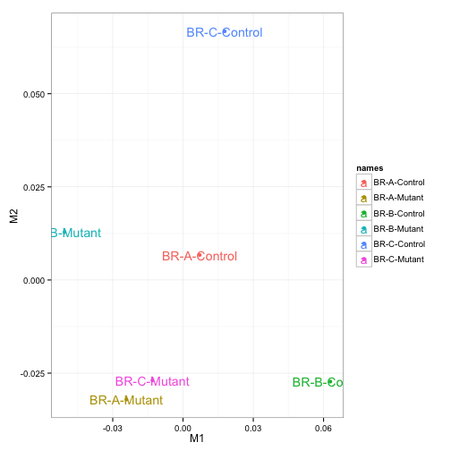
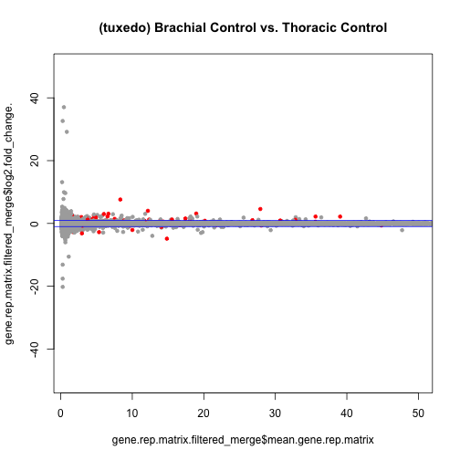
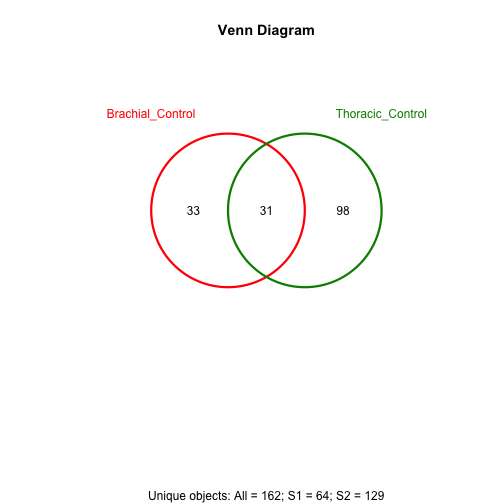

The script used to generate this report can be accessed here:
https://github.com/ljcohen/ljcohen.github.io/blob/master/analyses/Dasen/scripts/Dasen_RNAseq_report_tuxedo_brachial.Rmd


# Introduction

This is an RNASeq differential expression analysis from paired-end 50 data from an Illumina HiSeq 2500 high-output sequencing run, Combo_HSQ_10 that took place at the NYU Genome Technology Center on August 27, 2014. The experiment consisted of RNA extracted from Pbx mutant mouse cells (BR-A-Mutant, BR-B-Mutant, BR-C-Mutant) compared to control (BR-A-Control, BR-B-Control, BR-C-Control).

The BaseSpace link with run quality information is here:
https://basespace.illumina.com/s/xMRkLIeLf5Rn


# Table of Contents:
1. Data Analysis Procedure
2. MDS plot
3. MA plot
4. Heatmap
5. Contact
6. References

# 1. Data analysis procedure

The tuxedo RNASeq protocol was used for differential expression analysis.  The alignment program, Tophat (version 2.0.9), which uses bowtie2 (version 2.1.0), was used for reads mapping to the Ensemble NCBIM37/mm9 (iGenome version) reference genome. The mapped reads were subjected to subsequent necessary processing and PCR duplicates removal. For the differential gene statistical analysis, cufflinks (version 2.2.0) was used to assemble transcripts and calculate expression as Fragments Per Kilobase of transcript per Million mapped reads (FPKM). Tables with FPKM values for each sample replicate were generated with the cummerbund Bioconductor package in the R statistical programming environment.

Here, data analysis is presented from the brachial level.


```
## CuffSet instance with:
## 	 2 samples
## 	 54867 genes
## 	 162390 isoforms
## 	 98949 TSS
## 	 49485 CDS
## 	 54867 promoters
## 	 98949 splicing
## 	 21955 relCDS
```


# 2. MDS

 


# 3. MA plots

Size of results with all transcripts, no filtering:

```
## [1] 54867    20
```

Size of results q_value<0.05:

```
## [1] 143  20
```

q_value<0.05 and filtered low expressors (rowSums>1): 

```
## [1] 50 20
```

Size of results filtered low expressors (rowSums>1):

```
## [1] 36772
```

 

# 4. Heatmap


```
## NULL
```

 


# 5. Contact

Lisa Cohen, PhD student in MCIP, UC Davis     
Phone: 321-427-9335       
Email: ljcohen@ucdavis.edu

### Sequencing and original bioinformatics analysis by:

NYU Langone Medical Center   
Bioinformatics Core, Genome Technology Center, OCS   
Email: Genomics@nyumc.org         
Phone: 646-501-2834   
http://ocs.med.nyu.edu/bioinformatics-core  
http://ocs.med.nyu.edu/genome-technology-center   

Dr. Steven Shen, Associate Professor      
Email: ShuQuan.Shen@nyumc.org  
Phone: 212-263-2234           
Genome Technology Center, Office of Collaborative Sciences
and Center for Health Informatics and Bioinformatics
NYU School of Medicine,
227 E30th Street, Room 748, 
New York, NY 10016

# 6. References

R-Bioconductor: http://www.bioconductor.org/

cummeRbund: http://www.bioconductor.org/packages/release/bioc/vignettes/cummeRbund/inst/doc/cummeRbund-manual.pdf
